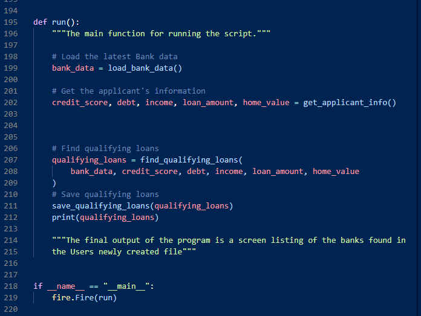
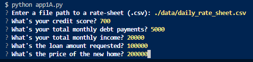
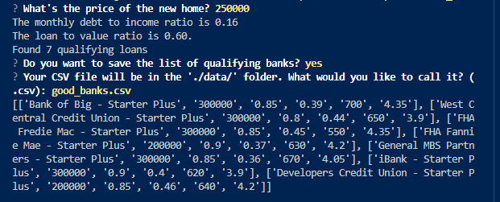
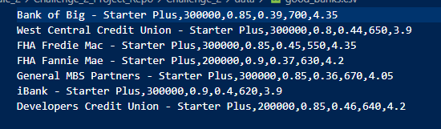

# *FinTech Boot Camp Repository - README.md File*
---


# Project Test Repo

This project is foundational in providing guidance toward building a comprehensive summary of the ways a README.md file can be populated with varying degrees of depth given the complexity of the project.  From Technologies, an Installation Guide, Usage - including screen shots/code blocks, diagrams or animations to guide the user through the sections of the code as well as how to use it and what it's meant to accomplish for the user, Contributors to the project and what licenses are required to use this program.  

---

## Technologies

This project was written in Python code and imported the Questionary library in order to make the code interactive with the User at the command line interface (CLI).  

The Language can be found at [Python](<http://python.org>) and the Questionary library can be found at [Questionary](<https://pypi.org/project/questionary/>). The Fire library is used and can be found here [Fire](<http://https://pypi.org/project/fire/>).  Additionally [pathlib] and particularly the module [Path] are imported in the code.  Information on these items can be found here [PATH_in_pathlib](<https://docs.python.org/3/library/pathlib.html>).  Finally, the CSV library is imported with information found here [csv](<https://docs.python.org/3/library/csv.html>).

This particular program will run on Windows 10 via VS Code or from [Github](<http://github.com/cryptopher2022>) called "Challenge 2 - Project Repo".  

---

## Installation Guide

### *This is how the libraries are imported into the program.  These import statements reside at the top of the code and are executed first.*

```python
from pathlib import Path
import fire
import questionary 
import csv    
```
>Here is one of our users enjoying his experience with the program.  From the Command Line (Like the old DOS prompt), navigate to the folder where the program "app1A.py" is found in the ./Challenge_2/Challenge_2/ folder.  From there, simply type: "python app1A.py"

---

## Usage

From this small block of code, numerous functions, libraries, csv files are pulled in, calculated, filtered and evaluated:   

*If time had allowed, I would have given more detail on the functions, input, output variables, etc.*

These are the input questions:


These are sample (not from the input above) follow on questions and answers plus a print out of the results on the Users screen: 


These are the sample results exported to the User defined .csv file: 



---

## Contributors

Christopher "Todd" Garner was the sole contributor to this program.  

---

## License

When you share a project on a repository, especially a public one, it's important to choose the right license to specify what others can and can't with your source code and files. Use this section to include the license you want to use.
